# 🎮 The Game Hub using Java
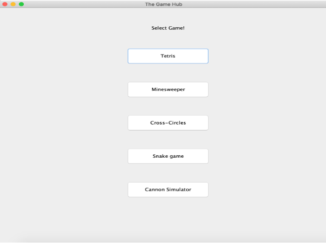

## 🕹️ Introduction

**The Game Hub** is an engaging platform that offers users a selection of classic and nostalgic games. Our goal is simple: to provide a fun and entertaining experience, reminding players of games they loved from the '90s. During the pandemic, many turned to online games as a way to unwind, and we wanted to capture that spirit.

In addition to providing entertainment, we designed **The Game Hub** to invoke nostalgia through games like **Snake** and **Minesweeper**—staples of earlier tech eras like Nokia phones and Windows 7 PCs. With five games in total, **The Game Hub** allows players to relive their childhood or discover these classic games for the first time. Whether you're aiming to beat your own high score or complete an objective, there's something here for everyone.

Our game selection includes:
- **Tetris**
- **Minesweeper**
- **Cross-Circles (Tic-Tac-Toe)**
- **Snake Game**
- **Cannon Simulator**

Although these games will likely resonate most with the 90s generation, their simplicity makes them enjoyable for everyone.

---

## 🛠️ System Design

The Game Hub features a GUI-based system developed using Java Swing, offering a smooth user experience. Five buttons allow players to select and launch different games instantly. The system design incorporates various **Design Patterns** to ensure efficient performance and maintainability.

### Key Design Patterns:

1. **Object Pool Design Pattern**
   - Efficiently reuses shapes in **Tetris**, like pShape and zShape, to avoid performance issues by recreating objects repeatedly.
   - 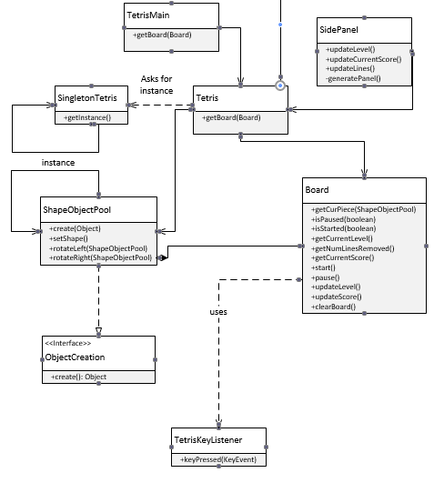

2. **Snapshot (Memento) Design Pattern**
   - Implemented in **Minesweeper** and **Cross-Circles** for restoring previous states, such as undoing moves or resetting the game.
   - 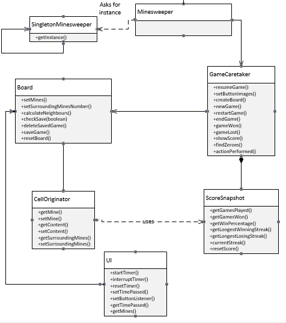

3. **Singleton Design Pattern**
   - Ensures only one instance of a game is instantiated at a time, so players can seamlessly transition between games without performance degradation.
   - 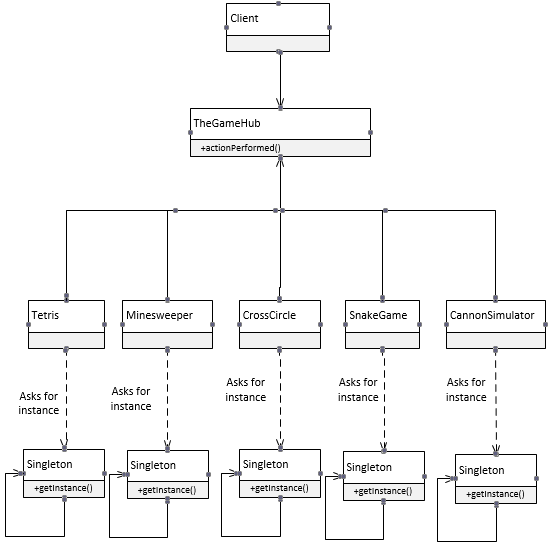

4. **Builder Design Pattern**
   - Used in **Cannon Simulator** to dynamically change the color and properties of cannonballs, hiding complex details while allowing easy customization.
   - 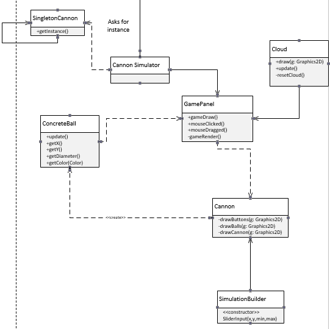

5. **State Design Pattern**
   - Incorporated in **Snake Game** to adjust behavior when the snake grows after consuming food or when food spawns in random locations.
   - 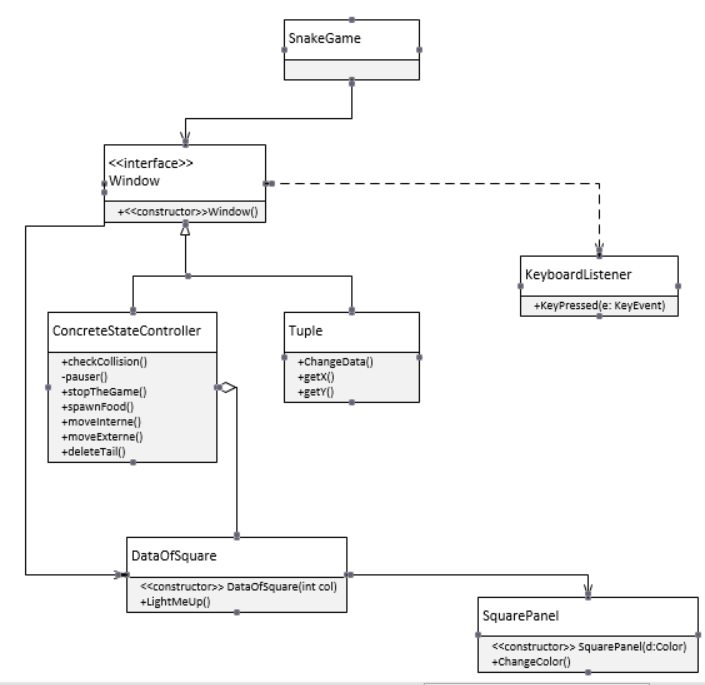

---

## 🧑‍💻 System Implementation

Each game in **The Game Hub** brings unique features to the table, ensuring a fun, nostalgic, and user-friendly experience.

### 🔲 Tetris
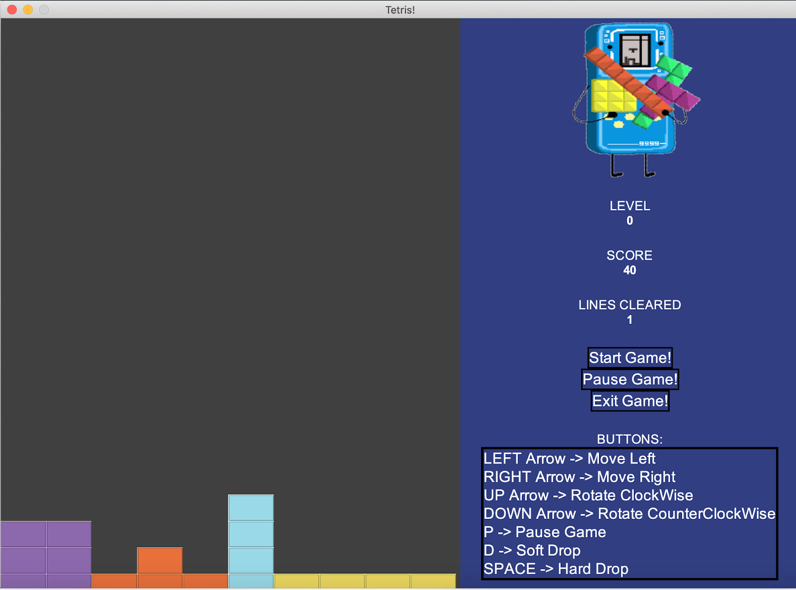
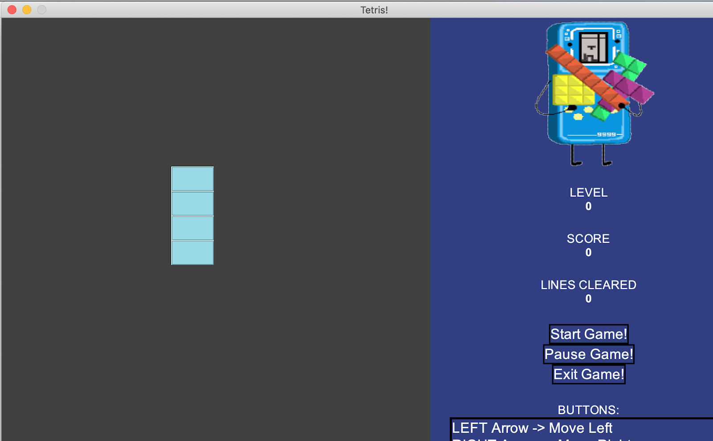

Features:
- Rotate shapes with arrow keys.
- Soft drop with 'D' key.
- Hard drop with spacebar.
- Line-clearing mechanics to level up.
- Pause functionality for game control.

### 💣 Minesweeper
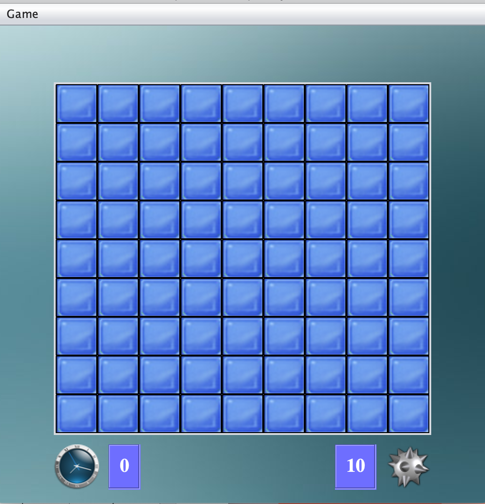
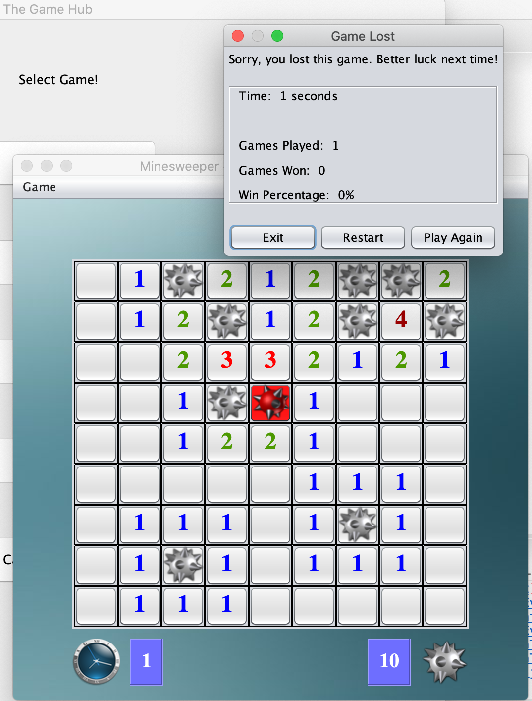

Features:
- Flag tiles with right-click.
- Track win percentage, games played, and streaks.
- Reset counters and start fresh whenever needed.

### ❌⭕ Cross-Circles (Tic-Tac-Toe)
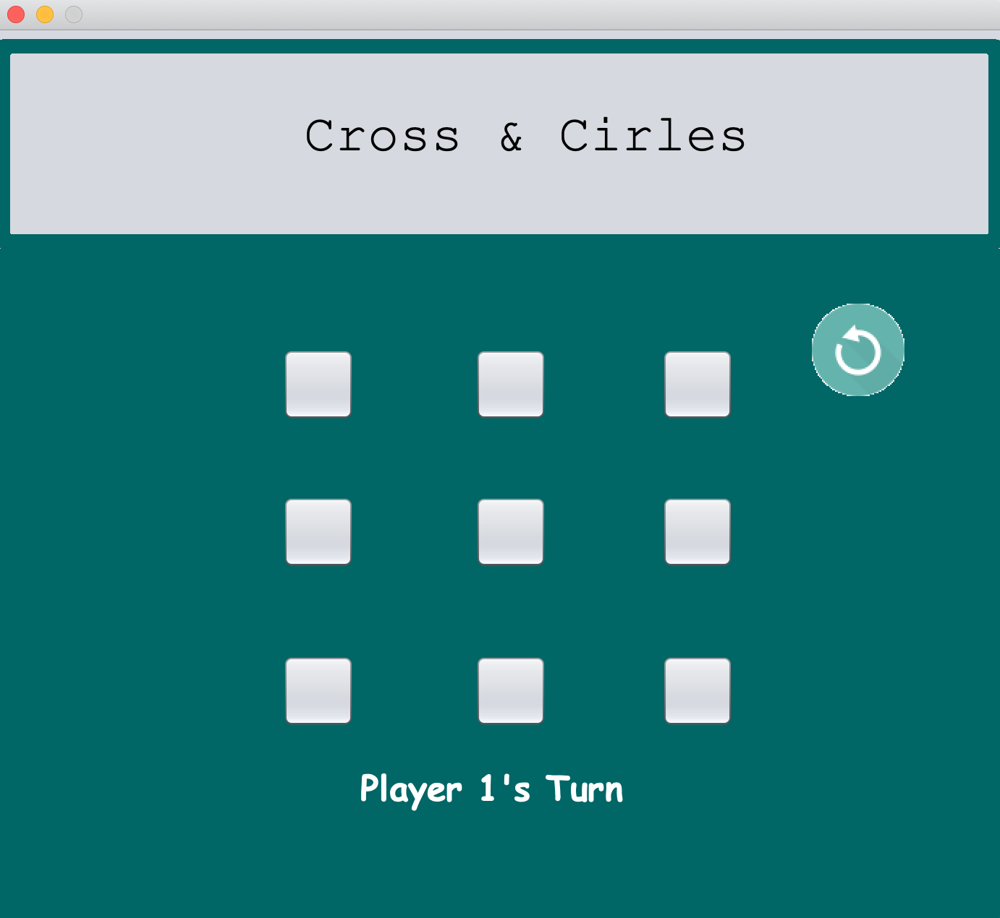
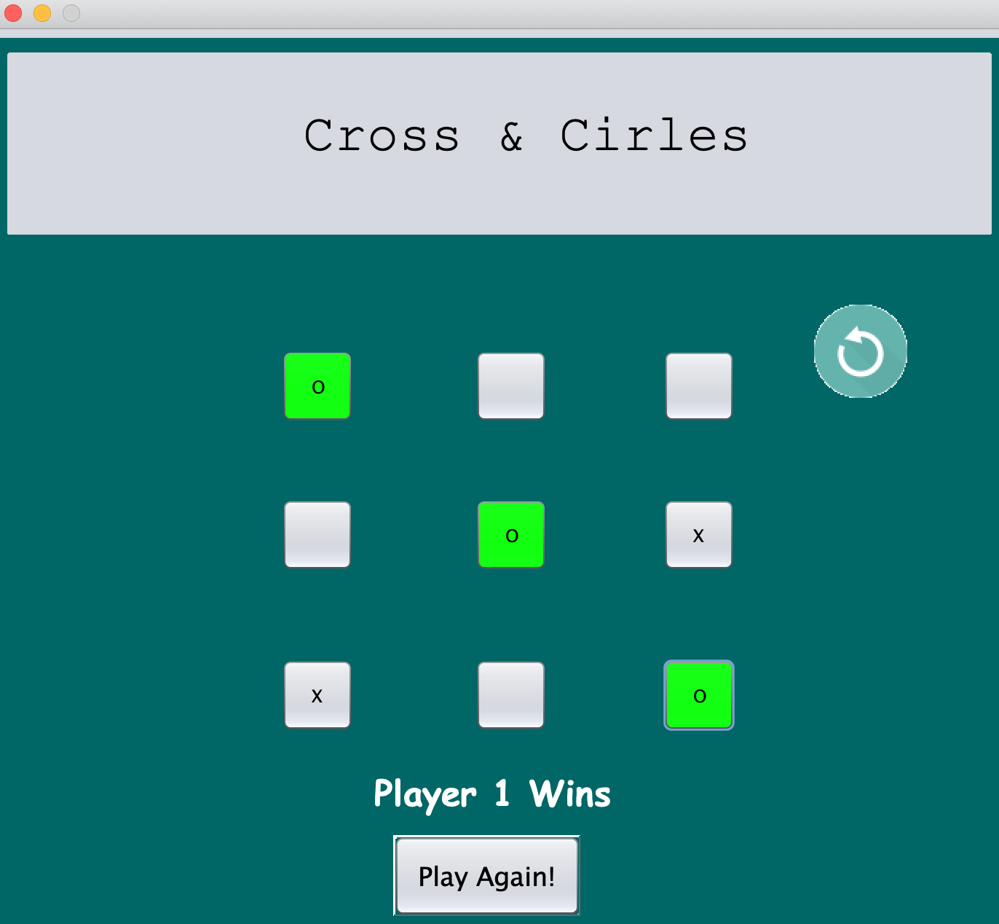

Features:
- Multiplayer gameplay.
- Undo and redo actions for strategic plays.
- Easy restart option for rematches.

### 🐍 Snake Game
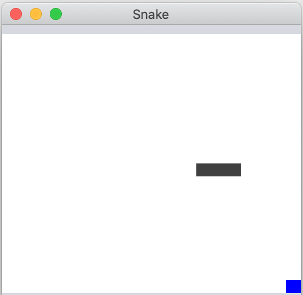
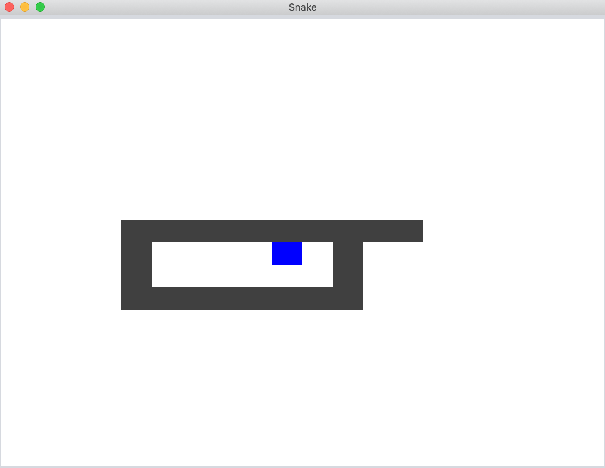

Features:
- Wrap-around boundaries to re-enter from the other side.
- Random food generation and snake size increases.
- Game-over when the snake collides with itself.

### 🎯 Cannon Simulator
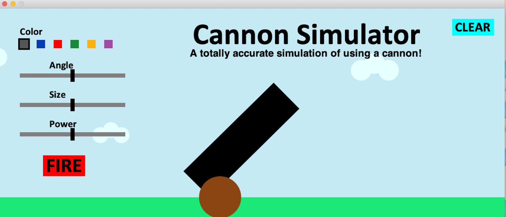
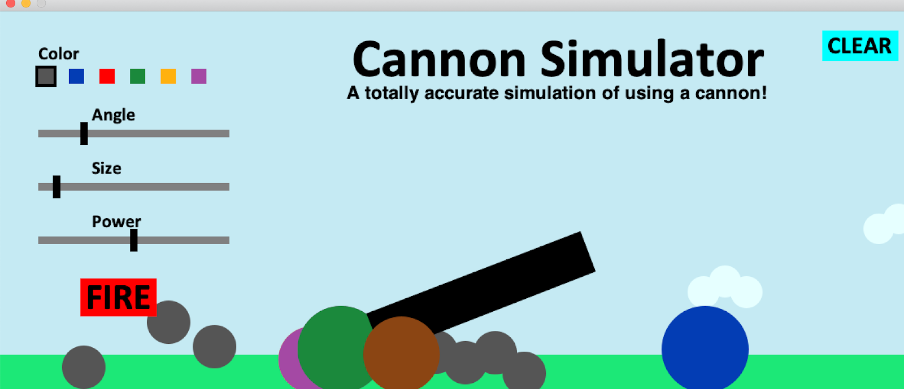

Features:
- Fire colorful cannons into the air.
- Adjust angle, size, and power of the cannons for varied gameplay.

---

## 📚 Lessons Learned

This project taught us the **power of design patterns** and their role in simplifying development and enhancing maintainability. By mapping each design pattern to specific game features, we ensured optimal performance while avoiding redundant code.

Some key takeaways:
- Mastering design patterns (Object Pool, Singleton, Builder, Snapshot, and State).
- Learning version control best practices for smooth project collaboration.
- The importance of organized version naming to avoid confusion during development.

Through **The Game Hub**, we not only explored creative problem-solving but also refined our skills in implementing effective software solutions with design patterns.

---
